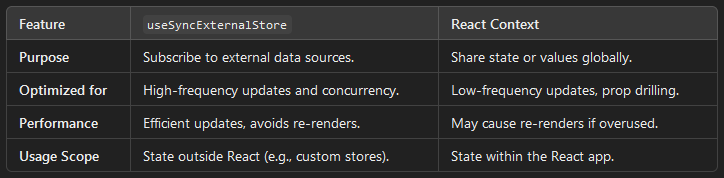
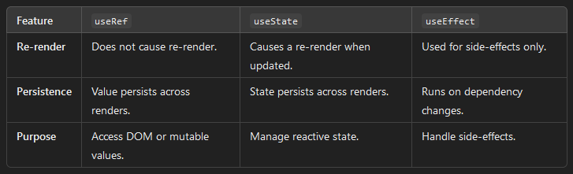

# PullYourFood plans

Csillagos elemek opcionálisak alfa verzióban

## Notes

### TODO

- sessionStorage-ba eltárolni a currentUsert és mindig parsolni azért nem jó, mert ha frissül (pl.: feltölt egy receptet) akkor csak logout és újra login után frissül az adat
  - Ezért áttérek contextes megoldásra, a currentUsert eltárolom index fileban
  - Valamilyen hook kell amit meg tudok hívni explicit, hogy mikor szeretném, hogy kérje le a currentUser adatát újra.

## Pages

### Explore

Browse recipes avaliable on the site

- Felbontani kategóriákra:
  - Tálétel, takeaway, leves, desszert, ital, ünnepi
  - Ezeken belül pedig időre kell bontani (5-15min, 15-30min, 30-60min, 1h+)

### Account

Manage your account

- Receptek feltöltése
- Értékelt receptek megtekintése
  - Szűrés értékelések között
- Elmentett receptek böngészése *
- Saját recept listák *

## Komponensek

### Recept tulajdonságok

- Feltöltő (default vagy *username*)
- Kategória
- Idő
- Hozzávalók
- Képek
- Értékelés [pont, db] *

### Felhasználó adatok

Mindenki regisztrálhat és tölthet fel/le illetve értékelhet recepteket

- Username
- Email
- Password
- Feltöltött receptek száma
- Mikor regisztrált (mennyi ideje)
- Age *
  - Valami ilyesmi, pontosítani:
  - Kid -12, Teen 12-18, Young adult 18-25, Adult 25-50, Young elder 50-70
- Pontszám *
  - Ez a feltöltött receptek alatti értékelések alapján számítódik
  - Minél nagyobb annál előrébb lesz a receptje az oldalon

## Jegyzetek

### Bővítés

A házi csak egy kezdetleges szint

- Majd kell adatbázis a hozzávalóknak is, alfában bármit írhatnak a userek
- Ez természetesen szinkronban lesz a frigoval, tehát ha pullolsz kaját akkor automatikusan lehúzza a groceryket is
  - Vagy frigoban alapból legyen bent minden?
    - Szerintem ne

### Kétségek és Biztosítások

Az egész frigo rendszerrel kapcsolatban

- Az egészet nem fogják használni az emberek, mert van már kialakult kajálási szokásuk
- Az informatika elveszi a kalandot az életből és ösztönöz a felgyorsulásra
  - A frigo hasznos, mert **írja mikor romlik meg a kajád**, de emellett ösztönöz arra, hogy ne légy tudatos hanem bízd magad egy alkalmazásra
  - Az emberek dependensek lesznek a technológiára
- Tök jó, hogy gyorsan be lehet vásárolni, kinézel egy receptet és bumm már bent van a bevásárló listádban
  - Plusz még ha jól összejön akkor írja menyibe fog kerülni
  - Csak ez kurva nehéz, hisz rengeteg féle élelmiszer van és nekem egy adatbázist kéne csinálnom minden élelmiszerről
  - **Olvasgatni kell recept oldalakat és kijegyzetelni a hozzávalókat**

## Elmélet

### useSyncExternalStore X Content

### Hooks

